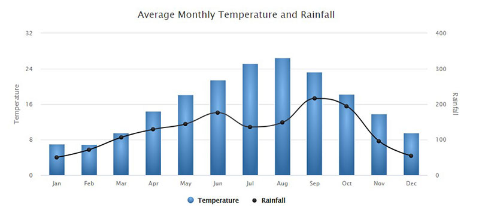

# Problem

Detecting hybrid DGAs, particularly the Banjori family, presents a significant challenge. Banjori combines both random characters and meaningful words to generate domain names, making them difficult to detect using traditional methods. <!--{ "layout": "two_column", "highlight": true }-->

| Domain | Type        | Notes          |
|--------|-------------|----------------|
| abc123.com | Randomized | DGA style A    |
| earnxyz.com | Hybrid     | Banjori sample |

Moreover, hybrid DGAs are increasingly prevalent due to their ease of deployment and ability to bypass legacy systems as well as manual inspection methods. This adaptability results in diverse and unpredictable domain patterns, rendering blacklist-based approaches ineffective. Therefore, a novel detection method focusing on identifying the complex behavioral patterns of Banjori is essential.

