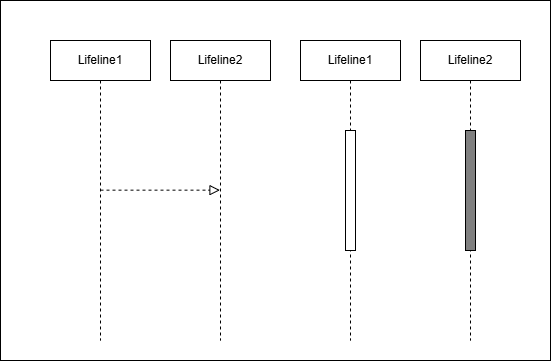

# Technical Field

## DGA Botnet

These are botnets that utilize Domain Generation Algorithms (DGA) to automatically generate new domain names periodically, making detection and mitigation more challenging. DGA enables botnets to evade security measures such as blacklists by generating thousands of dynamic domains daily.

## Character-Based DGA

Botnets such as Blackhole, Bamital, and CCleaner generate domain names based on random character patterns. This results in domain names that are difficult to predict and do not follow any semantic rules.

 

## Word-Based DGA

Some botnets, such as Bigviktor and Matsnu, generate domain names by combining legitimate words. This makes DGA-generated domains appear similar to legitimate ones, making detection more challenging.

## Hybrid DGA

Banjori is an example of a hybrid DGA, which combines both characters and words to generate domains, further complicating detection. Examples include:

- ``earn``estnessbiophysicalohax.com
  - ``earn``estnessbiophysicalohax.com
- ``kwto``estnessbiophysicalohax.com
